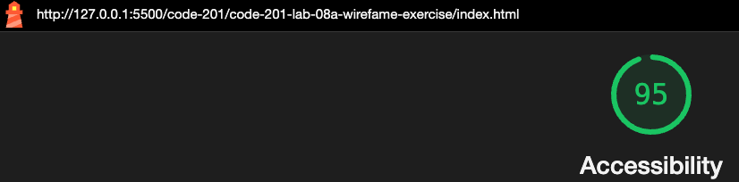

# LAB - 08

## Wireframe Exercise

I built a wiregrame doucment from the provided spec. The purpose of this wireframe is to present it to the client for feedback and allow them to drive what layouts they like and what they would like to change. This wireframe includes placeholder images and `lorem ipsum` text.

### Author: Rhett Chase

### Links and Resources

- [submission PR](https://github.com/rhettchase/code-201-lab-08a-wirefame-exercise)
- [web.dev flexbox](https://web.dev/learn/css/flexbox/)
- [W3Schools CSS Buttons](https://www.w3schools.com/css/css3_buttons.asp)
- [MDN](https://developer.mozilla.org/en-US/docs/Web/CSS/ID_selectors)
- ChatGPT

### Lighthouse Accessibility Report Score



### Reflections and Comments

- I used `flexbox` to allow for flexible styling
  - for example, I used `flex: 1` property to allow the content to take up available space
- I used dynamic `max-width` calculations and `box-sizing: border-box` property to get the sub banner images to stay aligned when the window size changed

```css
.sub-banner {
    display: flex;
    width: 100%;
    gap: 1rem;
    box-sizing: border-box; /* Include padding in the width calculation */
}
.sub-banner img {
    flex: 1; /* grow or shrink equally to fill available space */
    max-width: calc(33.333% - 1rem); /* 1rem is subtracted to account for the gap */
}
```
